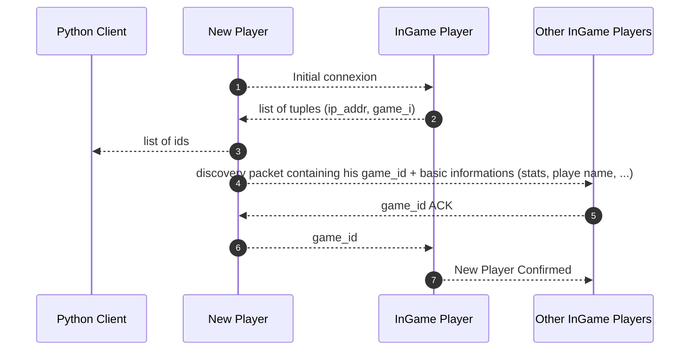

#  Network Protocols and IPC Handling

## __New Connexion protocol__

**The new player** needs an IP adress to enter the game.

In terms of networks, he thus needs an entry point, it can be any player of the game. We will consider this player as the **InGame Player**, taking the role of an information provider.
This selected player among the connected on will gives the two primary informations that the new player needs to fully interact with everyone in the game:

- **the players ip adresses**, whom to send packets to in the LAN
- **the players game ids** to link a packet with the right Character Instance in game.

## 